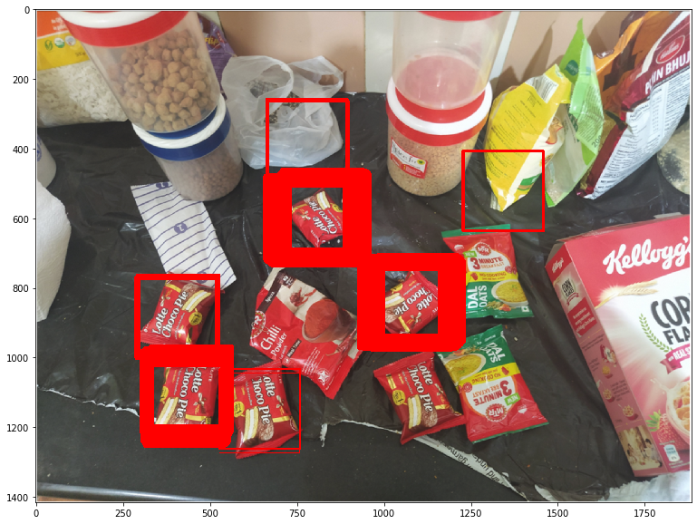

# GETTING STARTED
- Clone and cd into AI-Proctor repository.
```shell
git clone https://github.com/datasciencemachine/mowito-internship.git

cd mowito-internship
```

- Donwload the yolov3_training_last.weights file from this [link](https://drive.google.com/file/d/1xRZOxRO8Fjr2h6MyXIPTpGTHj_KbZW2l/view?usp=sharing) and add it to the same directory as the .ipynb files

**Note the wieghts file and the expert model file should be in the same directory**

- Install dependencies.

```shell
  pip install -r Requirements.txt
```

Now you can run the Beginner Model.ipynb file or the expert model.ipynb file on jupyter or any other IDE to detect the instances in the test image 

# RESULTS ACHIEVED
Here due to the lack of training images majorly template matching was focussed on, and not on any other deep learning model.
**Beginner Task**
 
 
 
 Here opencv template matching was used(matchTemplate() function). Since all the instances are detected, so no other high level model is used.
 
 **Expert Task**
 
 
 
 Again opencv template matching was used.
 *4/6 instances are detected, but still 2/6 are not detected, so we try other approaches such as yolo object detection*
 
 The yolo model was trained using a colab file with this [link](https://colab.research.google.com/drive/1YbRHcGEkxUiWvIoKPYA-DSYKBkVb3bKv?usp=sharing). The images used, were the     same as the templates provided
 
 
 
 The yolo detection model doesn't help much!!
 
 This was expected, since the number of training images were less than 10.
 
 
 
 
 Here more/all the instances have been detected, but a lot of false positives are also present.
 
 This result was achieved by reducing the threshold.
 
 
